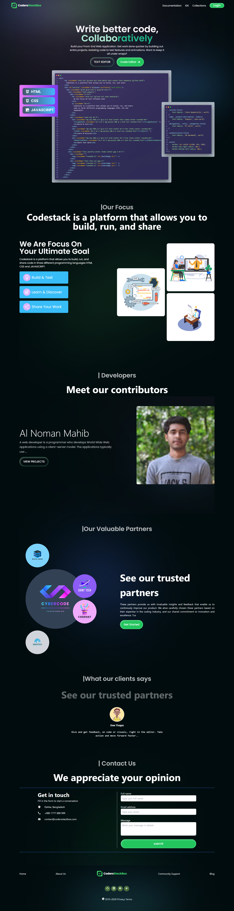
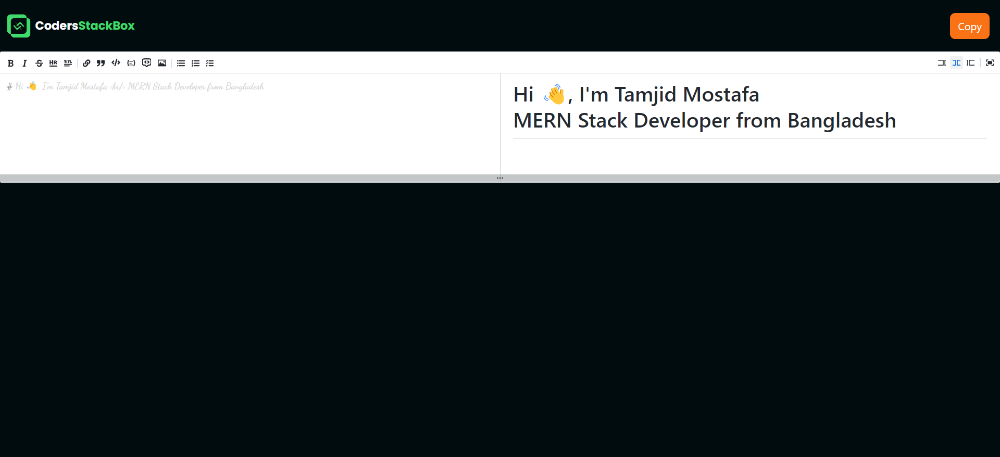
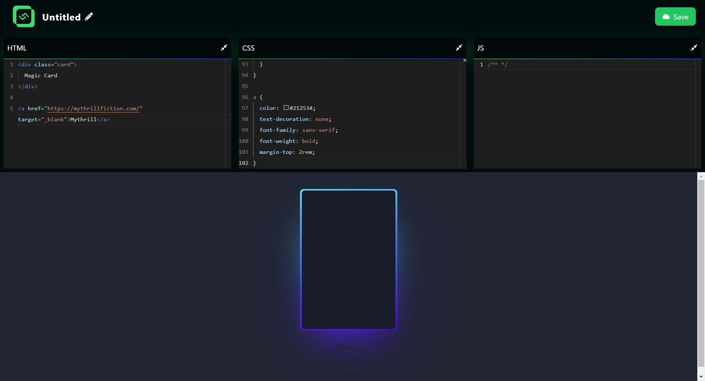
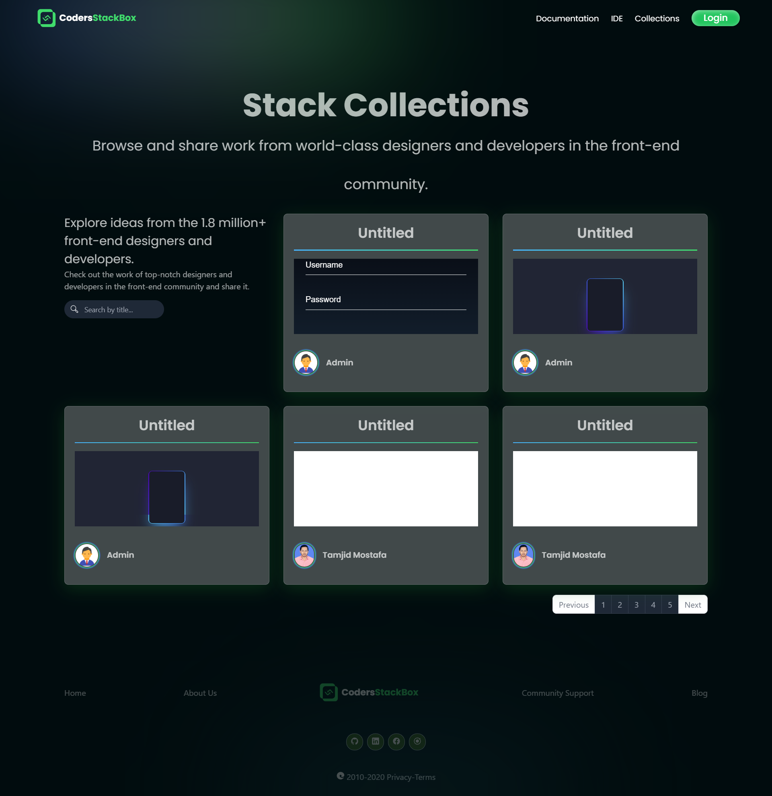
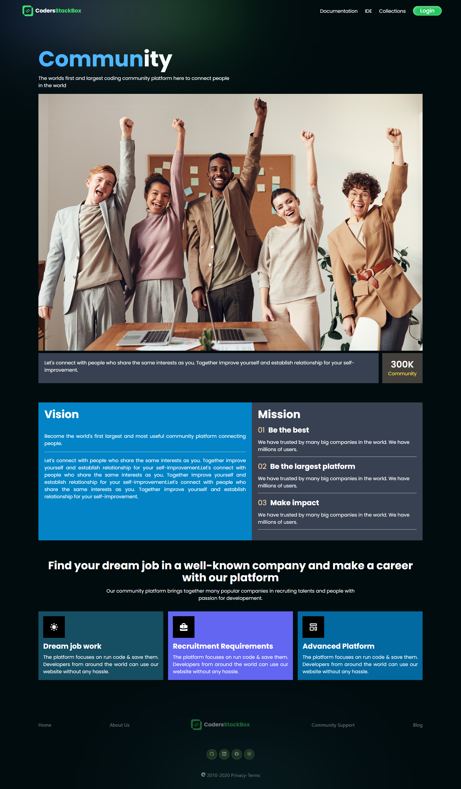

# CodersStackBox - Online Code Compiler

[Live Site](https://codersstackbox-c9449.web.app/)

## Documentation

"CodersStackBox" is a online code compiler. Using our code editor users can easily write code, run them & save them to our database. Our main goal is to create a development environment where they can share their design, and code with other’s developers without any cost.
## Front-End Technologies

- React.js

- Tailwind CSS
- Monaco-Editor
- Framer-Motion
- React-router-dom

## Back-End Technologies

- Mongoose

- Node.js
- Express.js

## Authentication & Hosting Technologies

- Firebase

- Vercel

## Authors

- [@xbayazid](https://github.com/xbayazid)

- [@Tamjid-Mostafa](https://github.com/Tamjid-Mostafa)
- [@chayon8080](https://github.com/chayon8080)
- [@Noman02](https://github.com/Noman02)
- [@0178811jes](https://github.com/0178811jes)
- [@1Md-Rakibul-Islam](https://github.com/1Md-Rakibul-Islam)

**Preview Images**  
***Home***

***IDE***

***Text Editor***

***Code Editor***

***Collection***

***About Us***

***Community Support***

***Documentation***

***Login***

***Sign Up***

***Error Page***

